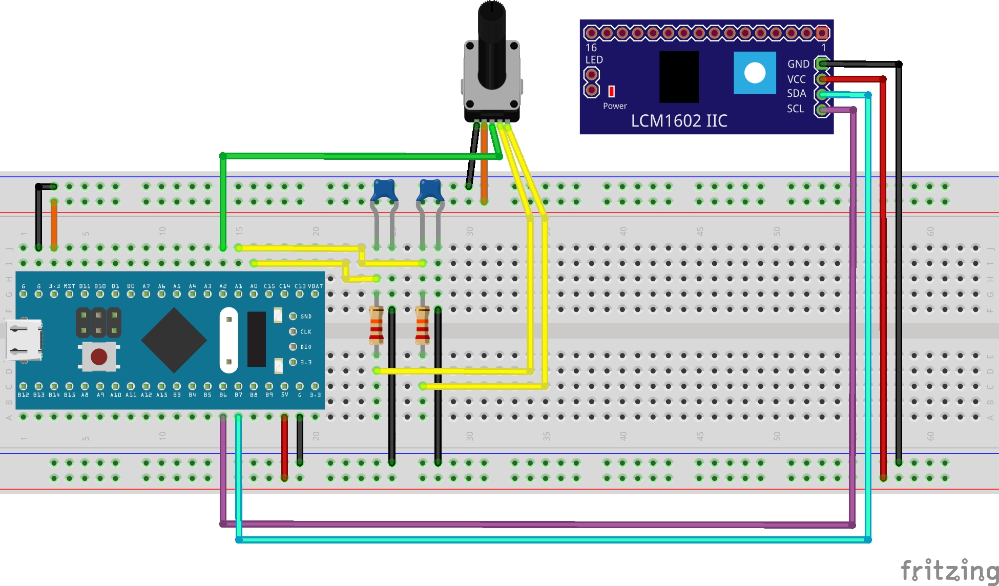

# Transistortester\_Blue

Build your own transistor tester on a breadboard and program it with Arduino. Inspired by the original microcontroller-based tester, this STM32-powered version is designed for simplicity, flexibility, and hands-on experimentation.

## Features
- Uses Arduino IDE for programming and customization
- Supports STM32 Bluepill

## Hardware
### Bluepill


## Getting Started
1. Clone the repo:
  ```
  git clone https://github.com/yourusername/Transistortester_Blue.git
  ```
2. Open the example sketch for your board (e.g. examples/Bluepill/Bluepill.ino)
3. Read the Example Sketch.

## Contributing
Pull requests, bug reports, and feature suggestions are welcome.

## License
This project is licensed under the __GNU General Public License v3.0__. See the `LICENSE` file for full details.

## Acknowledgments
This project was inspired by the incredible work of others in the open-source community. Special thanks to:
- [Original Transistortester Project by Markus Frejek and Karl-Heinz Kübbeler](https://github.com/Mikrocontroller-net/transistortester)
- [Making-of-a-Arduino-Based-Component-Tester by Sagar Saini ](https://github.com/halfstudents/Making-of-a-Arduino-Based-Component-Tester)
